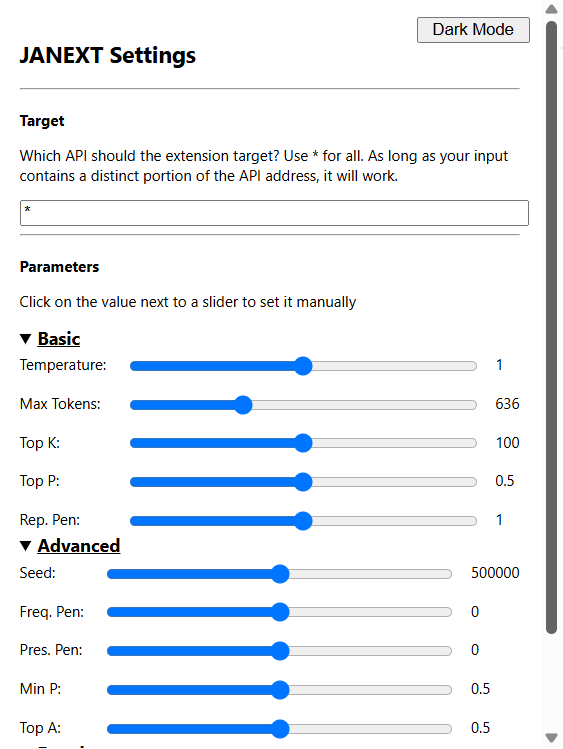

# JANEXT

Just `git clone` this, go to the extensions screen of your favorite Chromium browser, press "Load Unpacked" 
and select the folder containing these files. 

## Usage

Click on the extension in the extensions menu, change your stuff, click save, bingo bango, all outgoing requests to your chosen proxy from janitorai
should be affected with your new parameters. Note max token and temperatures in the extension will override that of your settings on janitorai, and
that if you do not enter anything in the extension, the `placeholder` value will be passed (the value the slider had before changing it). Don't worry,
all of the placeholders are set so the samplers are disabled by default. 

### Versions

Please note that releases in the [releases](https://github.com/ofteless/JANEXT/releases/) directory are the **only** official release versions. Using `git clone` or
`git pull`ing a release build may introduce bugs, issues, and new features that are **not suited for production**. I push my commits to GitHub often to let the community
keep track of progress, but it does not guarantee the product will be usable. Please stick to the releases unless you know what you are doing!

## Firefox

Sorry, this extension **will not and may never** support Firefox. See, referring to the [Mozilla docs](https://developer.mozilla.org/en-US/docs/Mozilla/Add-ons/WebExtensions/Chrome_incompatibilities), 
apparently there has been a bug in Firefox's `WebRequest` API implementation that makes it so you can't intercept network requests using the `activeTab` permission. Unless I want to request permission for `<all_urls>` which is sketchy,
I don't see any other way around this.

If I do bite the bullet and request frankly unreasonable permissions for a simple app like this, I'll mention it in the release notes. Thanks :D